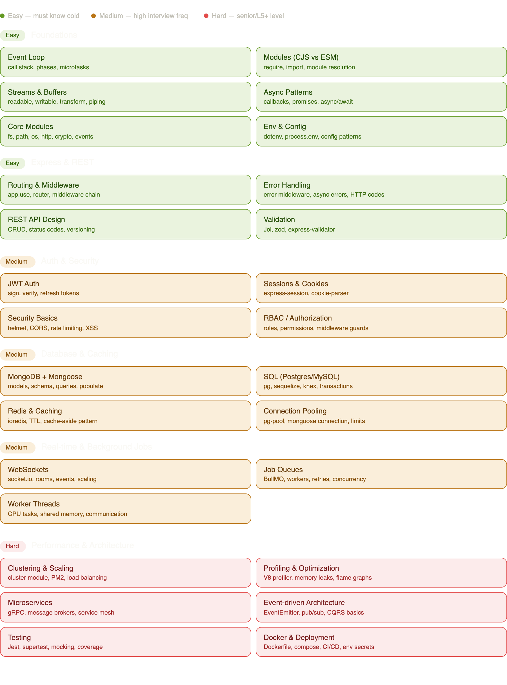

# Node js Backend



# Easy (must know cold) — 

* the event loop, modules, streams, async patterns, and Express basics. These come up in every backend interview, even at junior level. If you've been working on PW's Node backend, most of these you already know implicitly — just make sure you can explain them clearly.
# Medium (high frequency) — 

* JWT/auth, MongoDB/Mongoose (which you're already using), Redis caching, WebSockets, and job queues. These are the bread and butter of real product work. BullMQ in particular is underrated — almost every ed-tech backend at some point needs background job processing (sending emails, processing uploads, scheduled content).

# Hard (senior/L5+) — 

* clustering, profiling, microservices, and testing. You don't need to master all of these immediately, but having an opinion on each (and having built something with them) separates mid-level from senior candidates.

 
# Modules

* Before Es-6 require or module.export are used, but now, import , export and export default is used.

 ``` javascript

 export function add (x,y){
    return x+y;
}

export function multiply(a,b){
    return a*b;
}

// above code in index2.js file 
 import {add, multiply} from "./index2.js";

console.log(add(3,4));
console.log(multiply(3,4));

// you can also use this as well

import substract from "./index2.js"

export default function substract(x,y){
    return x-y;
}

// note here that if you export default then no need for curly braces;

 ```


